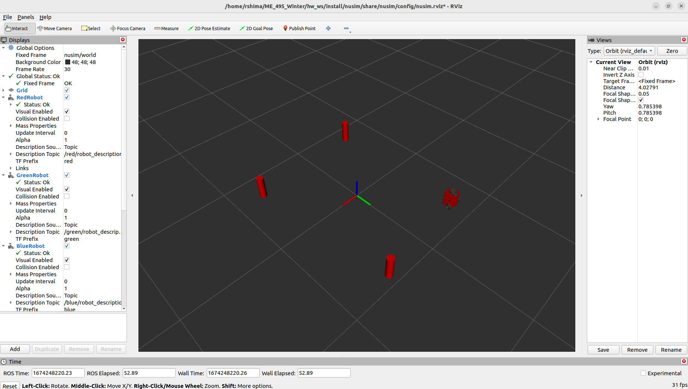

# Nusim
This package provides a simulated environment with obstacles and walls in RViz for a turtlebot.
## Launch File
* `ros2 launch nusim nusim.launch.xml` to see the red turtlebot, three cylindrical obstacles, and walls in RViz.
## Parameters
The following parameters in `config/basic_world.yaml` can be used to change the simulator settings:
* `rate` - A frequency used to run the main loop
* `x0` - The x component of the initial pose of the robot
* `y0` - The y component of the initial pose of the robot
* `theta0` - The theta component of the initial pose of the robot
* `obstacles`
    * `x` - A list of the obstacles' x coordinates
    * `y` - A list of the obstacles' y coordinates
    * `r` - The radius of the obstacles
* `walls`
    * `x_length` - the length of the arena in the world x direction
    * `y_length` - the length of the arena in the world y direction

