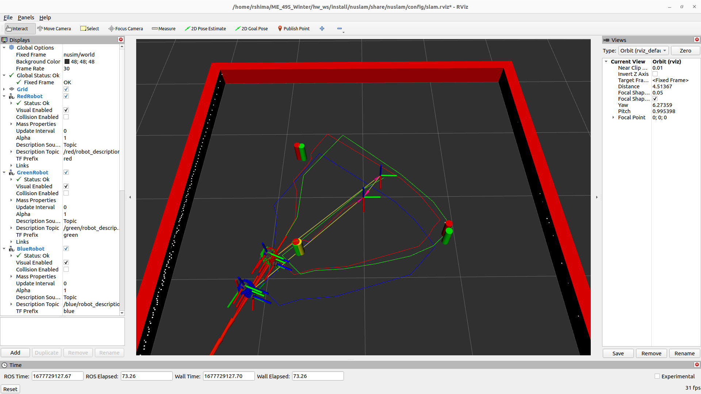

# Nuslam
This package implements Extended Kalman Filter SLAM with known and unknown data associations. The algorithm computes the locations of the robots and the locations of the landmarks relative to a map frame.
## Launch Files
* `ros2 launch nuslam slam.launch.xml` allows the user to run and visualize the SLAM algorithm with known data association. The arguments are the following:
    * `cmd_src` - Lets the user set it to 'circle' to start the circle node, 'teleop' to start the teleop_twist_keyboard, and 'none' to start nothing
    * `robot` - Lets the user set it to 'nusim' to start the nusim simulator, 'localhost' to run the nodes directly from the turtlebot3, and 'none' to not launch any additional nodes
    * `use_rviz` - Determines whether or not to launch RViz with a configuration that enables seeing the robot model, tf frames, and the odometry
* `ros2 launch nuslam unknown_data_assoc.launch.xml` allows the user to run and visualize the SLAM algorithm with unknown data association. The arguments are the following:
    * `cmd_src` - Lets the user set it to 'circle' to start the circle node, 'teleop' to start the teleop_twist_keyboard, and 'none' to start nothing
    * `robot` - Lets the user set it to 'nusim' to start the nusim simulator, 'localhost' to run the nodes directly from the turtlebot3, and 'none' to not launch any additional nodes
    * `detect_landmarks` - Determines whether or not to use the circle detection output for SLAM
## Parameters
The parameters in `nuturtle_description/config/diff_params.yaml` can be used to change the simulator settings. Please see the `nuturtle_description` package for a list of parameters.
## Screenshot

## Videos
Below is a video of the robot moving in a closed path in RViz with several landmarks (known data association):

[Alt-Text](https://user-images.githubusercontent.com/113070827/222328189-ac7f5df1-a594-42dd-954b-b6a3e2f50934.webm)

Below is a video of the robot moving in a closed path using unknown data association in RViz:

[Alt-Text](https://user-images.githubusercontent.com/113070827/226087892-dc3bafee-23e6-4628-a25f-5297e9bb8117.webm)

Final pose error between the actual robot position and odometry:

    position:
      x: 0.00591
      y: -0.00495
      z: 0.0
    orientation:
      x: 0.0
      y: 0.0
      z: 0.00308
      w: -0.00671

Final pose error between the actual robot position and the SLAM estimate:

    position:
      x: 0.01477
      y: -0.03123
      z: 0.0
    orientation:
      x: 0.0
      y: 0.0
      z: -0.01005
      w: 0.02104