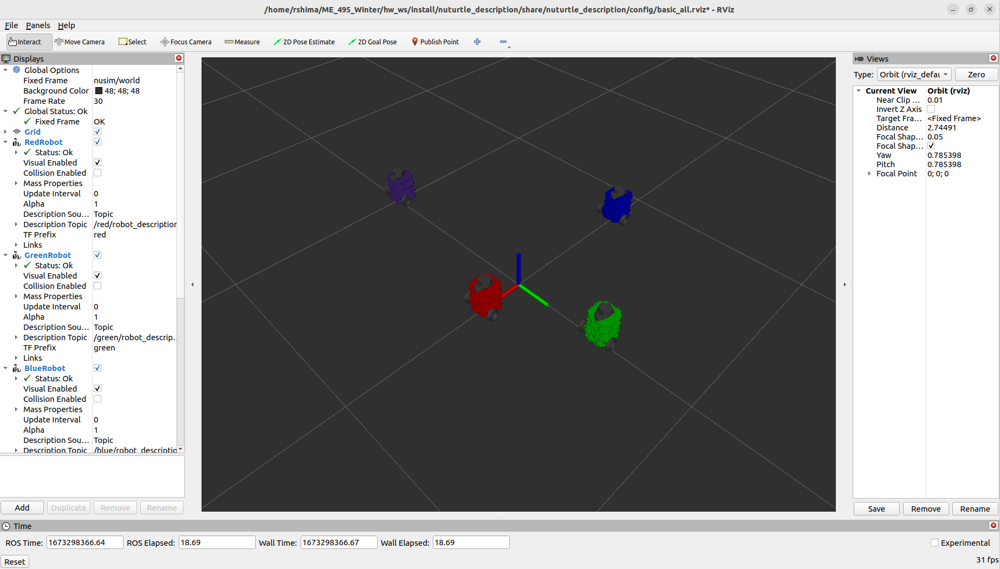

# Nuturtle  Description
URDF files for Nuturtle Herbert
* `ros2 launch nuturtle_description load_one.launch.py` to see the robot in rviz.
* `ros2 launch nuturtle_description load_all.launch.xml` to see four copies of the robot in rviz.

* The rqt_graph when all four robots are visualized (Nodes Only, Hide Debug) is:

## Launch File Details
* `ros2 launch nuturtle_description load_one.launch.py --show-args`

        Arguments (pass arguments as '<name>:=<value>'):

            'use_rviz':
                Flag to enable rviz. Valid choices are: ['true', 'false']
                (default: 'true')

            'use_jsp':
                Flag to enable joint_state_publisher. Valid choices are: ['true', 'false']
                (default: 'true')

            'color':
                Color of the robot. Default is purple. Valid choices are: ['purple', 'red', 'green', 'blue']
                (default: 'purple')

* `ros2 launch nuturtle_description load_all.launch.xml --show-args`

        Arguments (pass arguments as '<name>:=<value>'):

            'use_rviz':
                Flag to enable rviz. Valid choices are: ['true', 'false']
                (default: 'true')

            'use_jsp':
                Flag to enable joint_state_publisher. Valid choices are: ['true', 'false']
                (default: 'true')

            'color':
                Color of the robot. Default is purple. Valid choices are: ['purple', 'red', 'green', 'blue']
                (default: 'purple')
## Parameters
The following parameters in `config/diff_params.yaml` can be used to change the simulator settings:
* `wheel_radius` - the radius of the wheels
* `track_width` - the distance between the wheels
* `motor_cmd_max` - the max motor command
* `motor_cmd_per_rad_sec` - the motor command "tick"
* `encoder_ticks_per_rad` - the number of encoder "ticks" per radian
* `collision_radius` - the radius used for collision detection
* `input_noise` - the variance of Gaussian noise
* `slip_fraction` - the slip fraction used for the wheels
* `basic_sensor_variance` - the variance of Gaussian noise for the sensor
* `max_range` - the detection radius of the robot
* `lidar_min_range` - the minimum range of the lidar
* `lidar_max_range` - the maximum range of the lidar
* `lidar_angle_increment` - the angle increment of the lidar
* `lidar_num_of_samples` - the number of samples of the lidar
* `lidar_resolution` - the resolution of the lidar
* `lidar_noise_variance` - the variance of Gaussian noise for the lidar